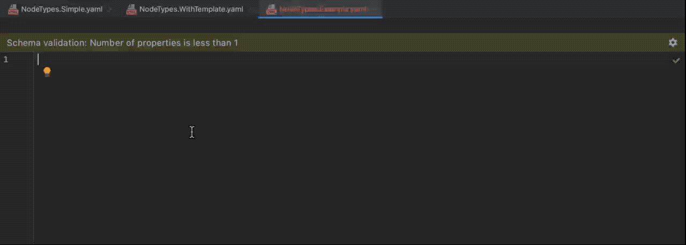

# JSON schema for Neos CMS nodetypes

This repository contains a [JSON schema](https://json-schema.org), that can be used in PHPStorm or VSCode
to get 

* autocompletion 
* typehints 
* validation of Neos CMS nodetypes files
* inline documentation

When the schema is stable enough it will hopefully be made available in the [schema store](https://www.schemastore.org/json/).

The schema is based on the old YAML schemas we already have in Neos & Flow. 
But they all need some converting and can be updated with the latest functionality of what JSON schema can do.
With a bit of community effort we can upgrade them, put them in the core, replace our own schema validator 
and make the schemas officially available on https://www.schemastore.org/json/.
The schemastore allows your IDE to automatically download the one your need.

## Features:

### Autocompletion

In addition to usual fields there are also conditional schema definitions for the following properties:

* `editor` (due to a [bug](https://ajv.js.org/) in IntelliJ, autocompletion doesn't show the matching `editorOptions` but validation works)
* `validation`

### Typehints

Typehints for all known Neos core nodetype properties.

### Validation

You can run validations against your nodetypes with [Ajv](https://ajv.js.org/) or similar.
See [test.js](test.js) for an example.

### Inline docs

This is still work-in-progress and only a few entries properties have full documentation.
Feel free to open a PR to add more.
We support the fields `title`, `description` and `x-intellij-html-description` for html docs.

## How to use

### PHPStorm / IntelliJ IDEA 

Follow the [official instruction](https://www.jetbrains.com/help/phpstorm/json.html#ws_json_schema_add_custom) and add the url: 

    https://raw.githubusercontent.com/Sebobo/Shel.Neos.Schema/main/NodeTypes.Schema.json

Make sure there is no space at the end of the url when pasting it into your IDE or the Schema will not validate.

Set `Schema Version` to `JSON Schema version 7`.

Add path mappings to the packages you work on. For example:

    DistributionPackages/*/Configuration/NodeTypes*.yaml

### Other editors

Visual Studio Code and [other editors](https://www.schemastore.org/json/) also support JSON schema. 
Instructions are easy to find with your favourite search engine.

### Schema variants

Certain declarations in a NodeTypes.yaml file are valid but not considered as "best practise".
The default schema mentioned in the instructions above will not enforce those.

#### Strict schema

If you want additional strict validation, you can instead use the strict schema with the url:

    https://raw.githubusercontent.com/Sebobo/Shel.Neos.Schema/main/NodeTypes.Schema.Strict.json

Implemented additional checks:

* Only 1 nodetype per file

## FAQ

### I get duplicate results for autocompletion

This happens when you have the Neos plugin installed in an IntelliJ IDE. 
The plugin also provides some basic autocompletion hints.

The developer of the plugin plans to use this schema in the future instead.
Then the duplicates will disappear.

## Contribution

If you know how to use the schema in other editors, please provide a PR with the instructions. 

If you have ideas on how to improve the schema, please provide an issue with an example, and a 
PR that would resolve the issue if you can.
